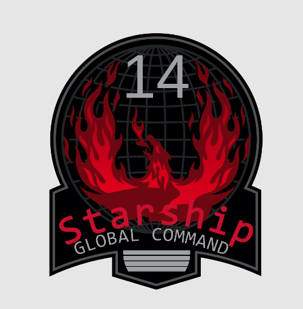

  

# Starship14: A RMC-14 fork
"Would you like to know more?"

This is a community-driven, action-packed reimagining of Space Station 14 based in a war-torn future where humanity battles endless hordes of alien bugs.

## Status
Currently in early development. Built off the RMC-14 codebase with plans for...

- Bug factions
- Propaganda systems
- Trooper classes
- High command AI
- Persistent Map / Galaxy Layer: A solar system map UI where players can see planets, moons, etc
- Faction Progression: Persistent war effort winning or losing affects control of systems, resources, etc.

## Building

1. Clone this repo.
2. Run `RUN_THIS.py` to init submodules and download the engine.
3. Compile the solution.

[More detailed instructions on building the project.](https://docs.spacestation14.com/en/general-development/setup.html)

## License

All code for the content repository is licensed under [MIT](https://github.com/space-wizards/space-station-14/blob/master/LICENSE.TXT).

Most assets are licensed under [CC-BY-SA-3.0](https://creativecommons.org/licenses/by-sa/3.0/) unless stated otherwise. Assets have their license and the copyright in the metadata file. [Example](https://github.com/space-wizards/space-station-14/blob/master/Resources/Textures/Objects/Tools/crowbar.rsi/meta.json).

Note that some assets are licensed under the non-commercial [CC-BY-NC-SA 3.0](https://creativecommons.org/licenses/by-nc-sa/3.0/) or similar non-commercial licenses and will need to be removed if you wish to use this project commercially.